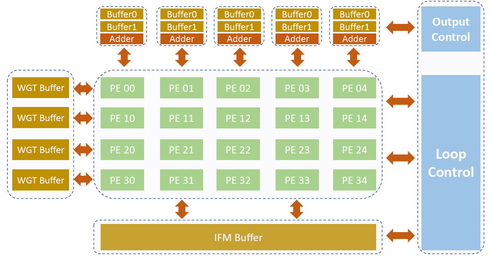
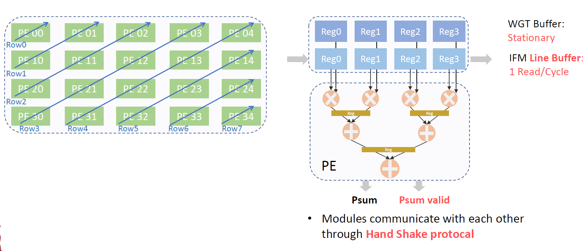
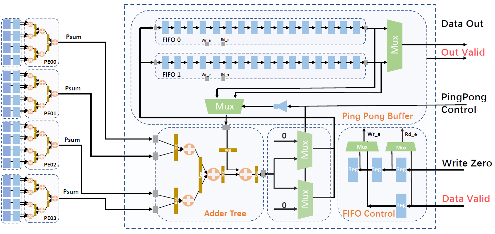
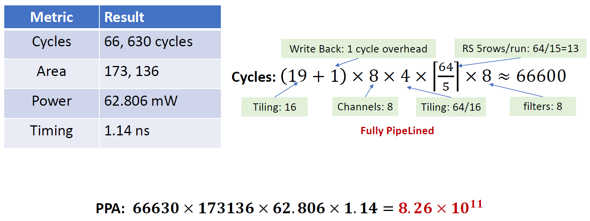

# CNN Accelerator VLSI
This is a simple CNN Accelerator design for the VLSI course project.

Authors:\
Rui Li: lirui@shanghaitech.edu.cn \
Lin Li: lilin@shanghaitech.edu.cn

**Notice: The files required by the synthesis part can not be public accessed, though we have proved that it is a synthesizable design, you may not be able to reproduce the result part. However, you can synthesize this desing to a FPGA, since we did not use any vender sepcific verilog grammer . (We use the Design Complier & VCS to compile and simulate our design)**

## Design requirements
Detailed requirements are under `./resource/Project_2.0.pdf`, the following lists some main requests:
* The bit length of all the input feature maps and weights is 8 bits, and the output is 25bits data.
* The input feature map bandwidth is 8x8 bits, and weight bandwidth is also 8x8 bits (maximally reading 8 input feature maps and 8 weights simultaneously)
* The output bandwidth is 2x25 bits (maximally writing 2 outputs to main memory simultaneously)
* The input addresses generation part is omitted, thus you can assume, on each request of the input feature map and weight, the data on the input port is correct (read the testbench for more details, basically, you first using the script `./testbench_gen.py` to generate all the memory footprints of the input feature map and weights, then read these files in your testbench). Though we have these assumptions in our design, it is still a general design, we can add these addresses generation part later for a real computing system.
* The size of the input feature map is 64x64xI where I is tunable parameters (number of input channels) ranging from 8 to 32， stepsize=8. The input filter size is 4x4xF where F is tunable parameters (number of filters), ranging from 8 to 32 stepsize=8.

## Design Overview

We implemented this simple CNN accelerator based on the [Eeyriss](https://ieeexplore.ieee.org/document/7738524). Basically, there are five parts in our design.
* The processing elements array (4x5), can process 5 rows of the input feature map simultaneously where each row of the array shares 4 8bits registers, and each diagonal row of the array shares a 4 8bits line buffer. This can significantly reduce the DRAM memory accesses while achieves high inference speed.
* The Weight buffer and Input Feature Map buffer, according to the computing pattern of the processing element array, each row shares the same weight buffer, and each diagonal row shares the same input feature map buffer. Thus, there are 4x8 registers for weight buffer and 8x8 registers for IFM buffer.
* The write-back buffer, the bandwidth of output feature map is restricted to 2 outputs/cycle, thus we added the ping pong buffer for each column of PE array. Basically, these buffers store the partial sum of the result, and we also add an adder tree for each write-back buffer.
* The output control, since we can generate 5 outputs/cycle where the bandwidth of output is 2 outputs/cycle, we add an output control to control the write-back buffer when to output and when to write zero (since we need write zeros to these buffer whenever computing a new output channel, we have optimized the time of these write zeros away through pipelining the output and write zero processes).
* The loop control is the central control part of the design where it reads the configuration of the input (i.e., how many channels, how many filters are there). It also supports the tiling, in this design, the tiling factor is set to 16. Tiling can reduce the partial sum buffer length and reduce overall areas, however, it can slightly increase the DRAM memory accesses.
### Processing Element

We pipelined all the components and added a register for each adder and multiplier output. This can improve the timing of the design and give more optimization space (i.e., retiming optimization) for the design compiler.
### Write Back Buffer

We also pipelined all the components of the write-back buffer, basically, it consists of two synchronous FIFOs, one adder tree, and one FIFO control signal generator. On each pop of the FIFO, we will add it to the addition result of the current partial sum and push it back to the same FIFO. The FIFO automatically handles all the memory address generation parts, this can save some address generation logic. The FIFO control part is extremely simple, only four 1bit registers and some muxes are needed, these registers corresponding to the pipeline stages of the write-back part. The ping pong control, write zero control are generated by another standalone write back control parts, read the `./src/WRITE_BACK.v` for more information.
### Interface design
All components in this design are communicated through the handshake protocol (precisely, it is partially handshake). Specifically, each module generates a valid signal on its output to indicate when the output data is valid and assume a valid signal on the input. This loosely coupled interface enables separately design and test of each module without precise cycle counts in the main control units.
### Optimizations

The above figure shows all the optimization techniques, that we used in this design.
## Usage
### RTL level simulation
The `./build_cnn.sh` will first build the CNN kernel and automatically write results to `./src/build/conv_acc_out.txt`, then you need to run `compare.py`, this will automatically compare CNN kernel's output with the golden result.
```bash
cd ./script
chmod 775 ./build_cnn.sh
./build_cnn.sh
```
We have successfully passed the RTL level simulation, the running results should be something like these
```bash
[ConvKernel: ] Build already exists, try to override it 
[ConvKernel: ] Copy benchmarks, under mode: 8x8t 
[ConvKernel: ] Start to run simulation 
[ConvKernel: ] Result writes to ./build/conv_acc_out.txt 
./simv -l sim.log -q
[ConvKernel: ] Set the clock period to 10ns
[ConvKernel: ] Start to compute conv
[ConvKernel: ] Computing channel:           1
[ConvKernel: ] Computing channel:           2
[ConvKernel: ] Computing channel:           3
[ConvKernel: ] Computing channel:           4
[ConvKernel: ] Computing channel:           5
[ConvKernel: ] Computing channel:           6
[ConvKernel: ] Computing channel:           7
[ConvKernel: ] Computing channel:           8
[ConvKernel: ] Finish writing results to conv_acc_out.txt
$finish called from file "../tb_conv.v", line 195.
$finish at simulation time               666345
Testing 488 [ConvKernel results]  488 [Golden results]  lines
Pass, Correct result !!!
```
### Synthesize & Netlist level simulation
First, we need to generate the netlist
```bash
cd ./src
dc_shell-t -f synth.tcl | tee -i run.log
write -format ddc -hierarchy -output ../rpt/CONV_ACC_mapped.ddc
write_sdf ../rpt/CONV_ACC_time.sdf
```
This will generate some timing area reports under `./rpt`. It also generates the netlist and sdf files under `./rpt`, these two files will be further used at the netlist simulation (the compile time is about 8mins). Then you can run the formality
```bash
cd ./src
fm_shell -f form.tcl | tee -i form.log
```
Read the `form.log` to see if you have successfully passed the formal verification (we have passed the formality in this design, see the `./rpt/form_rum.log` for details). Snaps of the formality report.
```bash
********************************* Verification Results *********************************
Verification SUCCEEDED
   ATTENTION: RTL interpretation messages were produced during link
              of reference design.
              Verification results may disagree with a logic simulator.
-----------------------------------------------------------------------
 Reference design: r:/WORK/CONV_ACC
 Implementation design: i:/WORK/CONV_ACC
 7670 Passing compare points
----------------------------------------------------------------------------------------
Matched Compare Points     BBPin    Loop   BBNet     Cut    Port     DFF     LAT   TOTAL
----------------------------------------------------------------------------------------
Passing (equivalent)           0       0       0       0      55    7615       0    7670
Failing (not equivalent)       0       0       0       0       0       0       0       0
****************************************************************************************
```
Then, you can do the netlist level simulation (This may take about 5mins). 
```bash
cd ./script
chmod 775 ./run_post_sim.sh
./run_post_sim.sh
```
We have successfully passed the netlist level simulation, the running results should be something like these
```bash
615 modules and 5 UDPs read.
../simv up to date
[ConvKernel: ] Copy benchmarks, under mode: 8x8t 
[ConvKernel: ] Start to run simulation 
[ConvKernel: ] Result write to ./build/conv_acc_out.txt 
./simv -l sim.log -q
Doing SDF annotation ...... Done

[ConvKernel: ] Set the clock period to 10ns
[ConvKernel: ] Start to compute conv
[ConvKernel: ] Computing channel:           1
[ConvKernel: ] Computing channel:           2
[ConvKernel: ] Computing channel:           3
[ConvKernel: ] Computing channel:           4
[ConvKernel: ] Computing channel:           5
[ConvKernel: ] Computing channel:           6
[ConvKernel: ] Computing channel:           7
[ConvKernel: ] Computing channel:           8
[ConvKernel: ] Finish writing results to conv_acc_out.txt
$finish called from file "../tb_conv_syn.v", line 196.
$finish at simulation time            666345000
Testing 488 [ConvKernel results]  488 [Golden results]  lines
Pass, Correct result !!!
```
Note that it reads the sdf files generated by the synthesis process. It seems that the simulation time is in ps, this is different from the RTL level simulation.

### Transfer your dataset from your server
You can generate some random datasets under the `./script/testbench_gen.py`, it depends on python3 and pytorch, so you may need another machine to run this code, the following script shows an example of transfering these dataset to your Design Compiler server.
```bash
scp -P xxx  ofm_dec_c8xh61xw61.txt xxx@xx.xx.xx.xxx:/home/xxx/xxx/cnn-accelerator/data/8x8t/ofm.txt &&
scp -P xxx  weight.txt ifm.txt xxx@xx.xx.xx.xxx:/home/xxx/xxx/cnn-accelerator/data/8x8t 
```
## Result

This is the simulation result of our design. The main focus of this design (reducing DRAM memory accesses) is not revealed on these metrics , since the power of DRAM accesses is not considered (not a fair metric ^_^).

## Reference
[1] Eyeriss: An Energy-Efficient Reconfigurable Accelerator for Deep Convolutional Neural Networks
